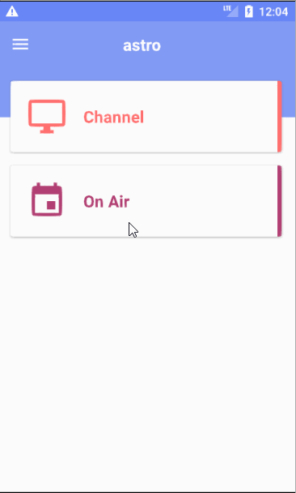

# AirChannel

Submitted by: **Minh Nguyen**

Time spent: 55 hours spent in total

## Citation
- Material Design with layouts and icons.
- MVP framework architecture.
- MVVM for list item.
- Dagger2, ReactAndroid (RxAndroid, RxJava).
- Butterknife, Android Data Binding.
- SQLite for local storage, Firebase Cloud for CRUD remote storage.
- Google SSO.
- Please build with Android Studio 3.0.

## User Stories
### Level 1

1. To display a list of Astro channels (showing at a minimum channel name and
number)

	a. Ability to sort by channel number
	b. Ability to sort by channel name

2. To allow a user to mark a favourite channel as on-device persistent.

	a. User launches app and tags a favourite channel
	b. User closes app and favourite channel appears in main screen identified
	as a favourite

### Level 2

1. All above; plus

2. To display a ‘TV guide’ in a display grid (eg http://whatson.astro.com.my/tv
guide)

	a. Display the current show for all channels currently airing current time
		i. Sort by channel number or channel name is a must
		ii. Pagination is allowed
		iii. ‘Lazy loading’ is encouraged
	
	b. Display must be responsive to device timezone.
	
### Level 3
	
1. All above; plus

2. On attempt by user to mark a favourite channel

	a. Will prompt user for login to a common SSO (Google / FB)

	b. Sorting order will include ‘favourites’ (along with channel number or
	channel name)

	c. Favourites and sorting order are to be securely CRUD in a cloud based
	service (eg. Any AWS method of storage EC2, RDS, S3)

	d. On logout, all information such as sorting order or favourite must be
	cleared from app.

## Techniques
- MVP, MVVM.

- Load channels and favorites from database, cache memory and server.

- Balance three streams database, cache and server.

- Lazy loading for on air shows: Query one third of list first then do lazy loading for one fourth in each loading until end.

- On air loading is responsive with device time. After one minute, the reload happens.

- Authenticated users have their own data on cloud.

## Walkthrough
  
